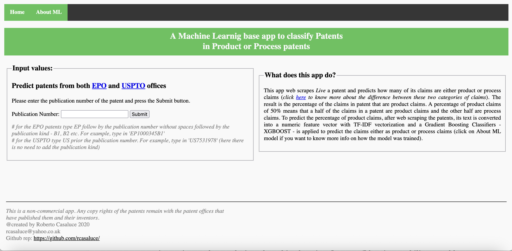
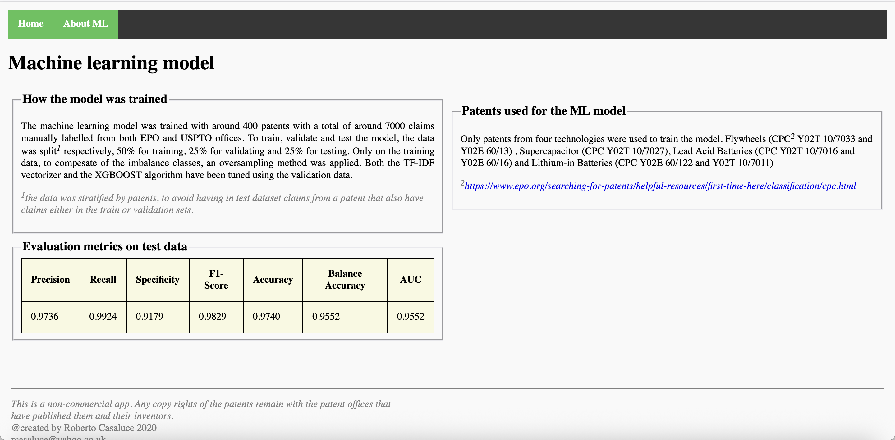

# Django web app patents classification

### [https://patents-classification.herokuapp.com/](https://patents-classification.herokuapp.com/)

`NB. The app is offline. The USPTO office has changed the layout of their search webpage, and this means that the web scraping function needs to be updated. TODO`

This app performs web scraping on live patents to predict how many of their claims are either product or process claims. The result is the percentage of claims in the patent that are product claims. For example, a percentage of product claims of 50% means that half of the claims in a patent are product claims, while the other half are process claims.

## Homepage app

To predict the percentage of product claims, the text of the patent is converted into a numeric feature vector using TF-IDF vectorization. Then, a Gradient Boosting Classifier - specifically XGBoost - is applied to predict whether the claims are product or process claims. If you want more information on how the model was trained, you can click on "About ML model".

The machine learning model was trained using approximately 400 patents, with a total of around 7000 claims manually labeled from both the EPO and USPTO offices. To train, validate, and test the model, the data was split into three sets: 50% for training, 25% for validation, and 25% for testing. An oversampling method was applied only to the training data to compensate for the imbalanced classes. The TF-IDF vectorizer and the XGBoost algorithm were both tuned using the validation data.

## Info page app

The original project to classify patents can be found [here](https://github.com/rcasaluce/final_project).

